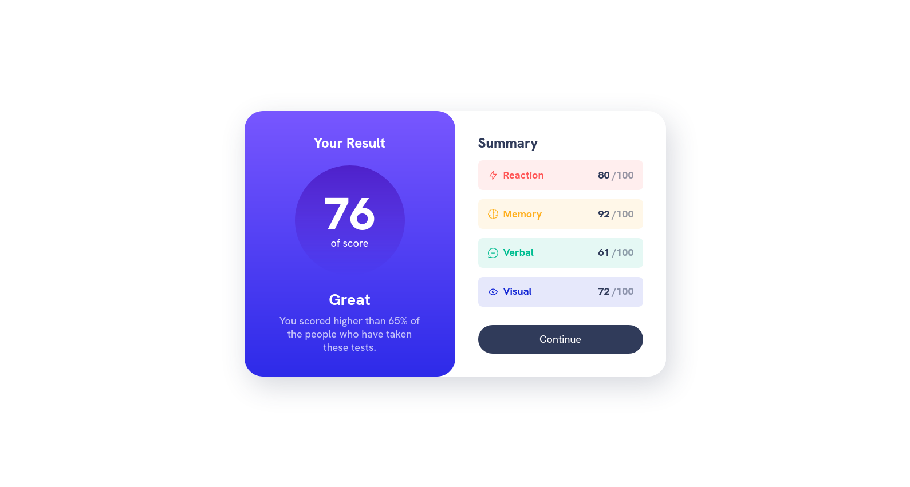

# Frontend Mentor - Age calculator app solution

This is a solution to the [Results summary component challenge on Frontend Mentor](https://www.frontendmentor.io/challenges/results-summary-component-CE_K6s0maV). Frontend Mentor challenges help you improve your coding skills by building realistic projects.

## Table of contents

- [Overview](#overview)
  - [The challenge](#the-challenge)
  - [Screenshot](#screenshot)
- [My process](#my-process)
  - [Built with](#built-with)
  - [What I learned](#what-i-learned)
- [Author](#author)

## Overview

### The challenge

Users should be able to:

- View the optimal layout for the interface depending on their device's screen size
- See hover and focus states for all interactive elements on the page

### Screenshot

### Links

- Solution URL: [Add solution URL here](https://your-solution-url.com)
- Live Site URL: [Add live site URL here](https://your-live-site-url.com)

## My process

### Built with

- Semantic HTML5 markup
- CSS custom properties
- Flexbox
- ReactJS
- React Hooks
- BEM

### What I learned

I found this a good project to practice my React skills.
-Created separate components for different sections of the application: - Result, Summary, Card
-Created a data.js file to work as a database
-With this data automatically calculate and render information to the screen

## Author

- Frontend Mentor - [@yourusername](https://www.frontendmentor.io/profile/yourusername)
